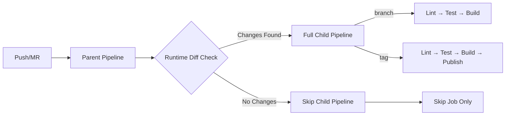

# Parallax Provider Tutorial Library — GitLab CI/CD README

[](https://docs.gitlab.com/ee/ci/)
[]()

A practical, **modular** GitLab CI/CD setup for fast, reliable builds—built
around **runtime file-diff gating**, **dynamic child pipelines**, and
**lightweight images**. This document explains **what problems we hit**, **why
they happened**, **how we fixed them**, and **what impact the fixes had**.

---

## Table of Contents

- [Overview](#overview)
- [Goals](#goals)
- [What I implemented](#what-i-implemented)
- [Architecture Decisions](#Architecture-Decisions)
- [Impact of the decisions](#impact-of-the-decisions)
- [GitLab CI: Problems, Root Causes, Solutions, Impacts](#GitLab-CI--Problems--Root-Causes--Solutions--Impacts)
- [Root Cause Analysis of Key Issues](#Root-Cause-Analysis-of-Key-Issues)
- [Example config snippets](#example-config-snippets)
- [Debug checklist / commands](#debug-checklist--commands)
- [Best practices & recommendations](#best-practices--recommendations)
- [Result of the fixes](#result-of-the-fixes)
- [Common errors and solutions](#common-errors-and-solutions)
- [Lessons Learned ](#Lessons-Learned)

---

## Overview

- **Modularized CI** into reusable templates so multiple workflows/projects can
  share the same jobs.
- **Downstream (parent/child) pipelines** decide at runtime whether to run a
  **full** workflow or an **empty** one (to avoid wasted runs).
- **Runtime git diff** in a **check** job (instead of `rules:changes`) to detect
  file changes robustly—even with shallow clones, force pushes, API-triggered
  pipelines, or all-zero SHAs.
- **Lightweight images** (`alpine`, `busybox`) wherever possible for faster
  spin-up.

---

## Goals

- **Speed:** minimal images, lean caches, fewer wasted jobs.
- **Reliability:** resilient to shallow history, force pushes, detached HEAD,
  and API triggers.
- **Maintainability:** modular job templates, fewer giant YAMLs, clear
  separation of concerns.
- **Scalability:** compose pipelines across branches/projects; reuse job blocks.
- **Determinism:** controlled caching, reproducible installs, explicit gating
  logic.

---

## What I implemented

### Solution Architecture

#### Core Innovation: Runtime Change Detection + Dynamic Pipeline Generation



### Key Components

| Component                    | Purpose                                              | Key Benefit                                                     |
| ---------------------------- | ---------------------------------------------------- | --------------------------------------------------------------- |
| **Parent Pipeline**          | Runtime analysis and decision making                 | Conditional entire workflow execution                           |
| **Child Pipelines**          | Isolated execution environments                      | Clean separation of concerns                                    |
| **Modular Templates**        | Reusable job definitions                             | Consistency across projects                                     |
| **Generate pipeline Script** | detect changed files and select pipeline accordingly | Reliable changed file detection and full control over pipelines |

---

## Architecture Decisions

### Why Parent/Child Pattern?

- **Compile-time limitations**: `rules:changes` fails with shallow clones
- **Resource efficiency**: Skip entire workflows, not individual jobs
- **Clear separation**: Decision logic isolated from execution logic

### Why Runtime Diff vs GitLab Rules?

- **Reliability**: Handles edge cases GitLab rules miss
- **Flexibility**: Custom change detection logic (file patterns, paths)
- **Debugging**: Explicit logs of what triggered execution

### Why Lightweight Images?

- **Speed**: `alpine:latest` (5MB) vs `ubuntu:latest` (72MB)
- **Cost**: Faster pulls reduce compute time
- **Security**: Smaller attack surface

---

## Impact of the decisions

- **Robust change detection** across pushing branches/tags and API triggers.
- **No more “bad object 000000…”** failures or broken `rules:changes`.
- **Zero flakiness** around `CI_COMMIT_BEFORE_SHA` and shallow clones.
- **Cleaner YAML** that scales across repos and branches.
- **Predictable child pipelines** (full/empty) with clear UI and messages.
- **Faster pipelines** (lighter images, fewer downloads, smarter cache).

---

## GitLab CI: Problems, Root Causes, Solutions, Impacts

### 1) `git diff` and `rules:changes` failed (all-zeros SHA, shallow clone, detached HEAD)

- **Problem:** Errors like `fatal: bad object 000000...` and “changes” rules not
  matching.
- **Root cause(s):**
  - `CI_COMMIT_BEFORE_SHA` is **all zeros** in some cases (first commit on
    branch, tag pipelines, API-triggered pipelines, mirrors, etc.).
  - Shallow clone (e.g., `GIT_DEPTH=20`) missing the base commit causes
    `git diff` or `merge-base` to fail.
  - GitLab runner checks out a **detached HEAD** by design, so branch pointers
    aren’t always available the way local workflows expect.

- **Solution(s) applied:**
  - Defensive diff logic in a **check job**:

    ```sh
    if [ "$CI_COMMIT_BEFORE_SHA" = "0000000000000000000000000000000000000000" ] || \
       ! git cat-file -e "$CI_COMMIT_BEFORE_SHA" 2>/dev/null; then
      CHANGED=$(git show --pretty="" --name-only "$CI_COMMIT_SHA" | grep -E '\.js$|\.json$|\.yml$|\..*rc$')
    else
      CHANGED=$(git diff --pretty="" --name-only "$CI_COMMIT_BEFORE_SHA" "$CI_COMMIT_SHA" | grep -E '\.js$|\.json$|\.yml$|\..*rc$')
    fi
    ```

  - (When needed) `git fetch --unshallow` or fetch the merge base explicitly.

- **Impact:** Robust change detection across pushes/tags/API triggers; no more
  “bad object” failures; “changes” logic is now under our control.

### 2) Dynamic child pipeline generation: YAML/heredoc and script file errors

- **Problems:**
  - `syntax error: unexpected end of file (expecting "fi")` when writing the
    dynamic config.
  - `.gitlab/generate-pipeline.sh: not found` even though the file existed.
  - “Unable to create pipeline: jobs include:\n - local config should implement
    the script, run, or trigger keyword”.

- **Causes:**
  - Indented/unquoted heredocs causing trailing spaces; missing closing `EOF`.
  - CRLF line endings in scripts (`\r\n`) on Linux shells.
  - The file we generated contained only `include:` at the top level but wasn’t
    **used via a trigger**; GitLab tried to interpret it as a **job**, hence the
    error.

- **Solutions applied:**
  - put the shell script into a separate generate-pipeline.sh file
  - Use **heredocs** with no indentation inside the file:

    ```sh
    cat > .gitlab/pipeline-config.yml << EOF
    include:
      - local: '.gitlab/child-full.yml'
    EOF
    ```

  - Ensure scripts are executable and run using shell this takes LF line endings
    as shell scripts can ran seamlessly on alpine images

    ```sh
    chmod +x .gitlab/generate-pipeline.sh
    sh .gitlab/generate-pipeline.sh
    ```

  - Trigger child pipeline correctly from the parent job:

    ```yaml
    trigger_child_pipeline:
      stage: trigger
      trigger:
        include:
          - artifact: .gitlab/pipeline-config.yml
            job: check_for_relevant_files
        strategy: depend
    ```

- **Impact:** Dynamic “full vs empty” child pipelines now load reliably; no
  heredoc/EOF errors; clean separation of logic (parent checks, child runs).

### 3) Artifacts auto-downloaded by later jobs

- **Problem:** `build` was pulling artifacts from `lint_and_test` even though
  not needed.
- **Cause:** Default artifact dependency behavior (or `needs:` without
  `artifacts: false`).
- **Solutions:**
  - `needs: [ { job: lint_and_test, artifacts: false } ]`

- **Impact:** Faster jobs, less network churn, cleaner pipeline.

## Root Cause Analysis of Key Issues

- **Modular Pipeline Design** gitlab provides very simple mechanism to
  modularize the pipeline files into different templates and call them in one
  file by using `include:` to use templates, we can use `include:` in any number
  of files once per file to call any number templates from our own project or
  different project
  - **Split logic by concern**: Break down lint, build, test, and release into
    their own templates.
  - **Keep templates minimal**: Each template should handle a single concern to
    maximize clarity and reuse.

- **Explicit Sharing Between Jobs** Every job runs in its own fresh container
  which its own docker image, so variables, caches, and artifacts are **not
  passed automatically**. Always declare what needs to be passed, or jobs will
  waste time reinstalling or rebuilding dependencies.

- **Image Size Dominates Pipeline Speed:** network transfer time to pull the
  larger base image often exceeds job execution time
  - node-18:Alpine Linux vs Ubuntu: 87% size reduction
  - Lightweight images compound benefits in saving time across multiple jobs

- **Limits of `rules:changes`** GitLab’s built-in `rules:changes` relies
  internally on `git diff` between previous commit and current commit. It fails
  in API-triggered pipelines because GitLab sets the previous commit SHA to all
  zeros `00000000...`. For reliability, consider custom runtime script with
  `git diff` logic.

- **Compile-time vs Runtime Decisions** GitLab evaluates `rules` at **compile
  time**, while `script:` runs at **runtime**. This means job's condition
  involving `rules` can’t be influenced by script output. Use **downstream child
  pipelines** when runtime data must influence execution of subsequent jobs.

- **Nested Pipelines Made Easy** Unlike other CI/CD tools that need API calls,
  GitLab allows multi-level pipeline nesting (parent → child → grandchild)
  directly with the `trigger` keyword. This makes complex workflows
  straightforward to implement.

- **Parent/Child pipline Independence** Parent and child pipelines run
  independently, with separate job IDs by default not influencing each other's
  status. A child pipeline can fail while the parent pipeline still shows
  success. To synchronize results and reflect combined status, use
  `strategy: depend` under the parent pipeline's `trigger`.

---

## Example config snippets

### Repo layout (modular templates)

```
.gitlab/
  build/
    build.yml
  lint_and_test/
    lint_and_test.yml
  release/
    release.yml
  child-pipeline/
    child-full.yml
    child-empty.yml
  generate-pipeline.sh
```

### Parent pipeline (`.gitlab-ci.yml`)

```yaml
image: alpine:latest

stages: [check, trigger]

workflow:
  rules:
    - if:
        '($CI_COMMIT_BRANCH == "gitlabci" || $CI_COMMIT_TAG) &&
        $CI_PIPELINE_SOURCE == "api"'
    - when: never

check_for_relevant_files:
  stage: check
  image: alpine:latest
  script:
    - apk add --no-cache git
    - chmod +x .gitlab/scripts/generate-pipeline.sh
    - .gitlab/scripts/generate-pipeline.sh
  artifacts:
    paths: [.gitlab/pipeline-config.yml]
    expire_in: 10 min

trigger_child_pipeline:
  stage: trigger
  trigger:
    include:
      - artifact: .gitlab/pipeline-config.yml
        job: check_for_relevant_files
    strategy: depend
```

### `generate-pipeline.sh` (runtime diff → decide full/empty)

```sh
#!/usr/bin/env sh
set -eu

# Detect changed files (fallback when BEFORE_SHA is zeros or missing)
if [ "${CI_COMMIT_BEFORE_SHA:-0000000000000000000000000000000000000000}" = "0000000000000000000000000000000000000000" ] || \
   ! git cat-file -e "$CI_COMMIT_BEFORE_SHA" 2>/dev/null; then
  CHANGED=$(git show --pretty="" --name-only "$CI_COMMIT_SHA" | grep -E '\.js$|\.json$|\.yml$|\..*rc$' || true)
else
  CHANGED=$(git diff --pretty="" --name-only "$CI_COMMIT_BEFORE_SHA" "$CI_COMMIT_SHA" | grep -E '\.js$|\.json$|\.yml$|\..*rc$' || true)
fi

mkdir -p .gitlab

if [ -z "$CHANGED" ]; then
  printf "No relevant changes — generating EMPTY pipeline.\n"
  cat <<'YAML' > .gitlab/pipeline-config.yml
include:
  - local: '.gitlab/child-empty.yml'
YAML
else
  printf "Found relevant changes:\n%s\n" "$CHANGED"
  cat <<'YAML' > .gitlab/pipeline-config.yml
include:
  - local: '.gitlab/child-full.yml'
YAML
fi
```

### Child (full) `.gitlab/child-full.yml`

```yaml
image: node:18-alpine

stages: [test, build, release]

# Cache (prefer Yarn cache; pull-only here)
.cache_common: &cache_common
  key: yarn-cache
  paths:
    - /root/.cache/yarn/

lint_and_test:
  stage: test
  cache:
    <<: *cache_common
    policy: pull
  script:
    - yarn install --frozen-lockfile --ignore-scripts
    - yarn lint
    - yarn test
  artifacts:
    when: always
    reports:
      # Prefer Cobertura from Jest: jest --coverage --coverageReporters=cobertura
      # coverage_report:
      #   coverage_format: cobertura
      #   path: coverage/cobertura-coverage.xml
    paths:
      - coverage/
    expire_in: 1 week

build:
  stage: build
  needs: [{job: lint_and_test, artifacts: false}]
  cache:
    <<: *cache_common
    policy: pull
  script:
    - yarn install --frozen-lockfile --ignore-scripts
    - yarn build
  artifacts:
    paths: [dist/]
    expire_in: 1 week

release:
  stage: release
  needs: [{job: build, artifacts: true}]
  rules:
    - if: '$CI_COMMIT_TAG =~ /^v[0-9]+\.[0-9]+\.[0-9]-gitlabci\.[0-9]+$/'
      when: on_success
    - when: never
  script:
    # Option A: publish from dist/ to avoid lifecycle scripts entirely
    - echo "//registry.npmjs.org/:_authToken=$NPM_TOKEN" > ~/.npmrc
    - cp package.json dist/
    - cd dist
    - npm publish --access public
```

### Child (empty) `.gitlab/child-empty.yml`

```yaml
image: busybox:latest

stages: [skip]

skip_job:
  stage: skip
  script:
    - echo "No relevant changes — skipping downstream jobs."
```

---

## Debug checklist / commands

```bash
# See env quickly
printenv | sort

# Where am I / what files exist?
pwd && ls -la && ls -la .gitlab || echo "no .gitlab"

# Show 20 commits
git log --oneline -n 20

# Inspect SHAs
echo "CI_COMMIT_SHA=$CI_COMMIT_SHA"
echo "CI_COMMIT_BEFORE_SHA=$CI_COMMIT_BEFORE_SHA"
git cat-file -e "$CI_COMMIT_BEFORE_SHA" 2>/dev/null && echo "before exists" || echo "before missing/zeros"

# Fallback change detection
git show --pretty="" --name-only "$CI_COMMIT_SHA"
git diff --pretty="" --name-only "$CI_COMMIT_BEFORE_SHA" "$CI_COMMIT_SHA"

# Fix CRLF on scripts
sed -i 's/\r$//' .gitlab/scripts/*.sh
chmod +x .gitlab/scripts/*.sh
```

---

## Best practices & recommendations

- **Measure and optimize job performance** — Always review job logs to
  understand execution time. This helps identify redundant steps (e.g.,
  repeatedly saving caches) and optimize resource-heavy processes, such as
  replacing large base images with lightweight ones.

- **Debug API requests locally with `curl`** — Before pushing changes to GitHub
  or running Actions, test your GitLab API requests using `curl` from the
  terminal. This allows faster debugging, quick experimentation with tokens,
  branch names, and payloads.

- **Explicitly pass data between jobs** — Never assume that variables,
  artifacts, or caches will be shared automatically. Each job runs in its own
  isolated container, so explicitly define what needs to be passed.

- **Use pipeline trigger tokens** — For API-triggered pipelines, rely on trigger
  tokens. They don’t require additional permissions and are purpose-built for
  securely starting pipelines.

- **Think “infrastructure as code”** — Treat `.gitlab-ci.yml` like code. Break
  logic into modular templates, group related tasks, and design conditional
  execution paths for cleaner pipelines.

- **Externalize complex scripts** — For long or multiline scripts, store them in
  separate files and invoke them within your pipeline (ensuring they have
  execute permissions). This improves readability and maintainability.

- **Leverage YAML anchors** — Reuse repetitive code with YAML anchors to keep
  pipelines DRY (Don’t Repeat Yourself).

- **Use custom scripts when needed** — Remember that YAML pipelines ultimately
  run shell scripts under the hood. If native features fall short, define custom
  script-based solutions.

---

## Common errors and solutions

| Error / Symptom                                                            | Root Cause                                                                     | Fix                                                                                                           |
| -------------------------------------------------------------------------- | ------------------------------------------------------------------------------ | ------------------------------------------------------------------------------------------------------------- |
| `fatal: bad object 000000...`                                              | `CI_COMMIT_BEFORE_SHA` is set all zeros on API/trigger based pipeline          | Use `git diff` to compare previous commit with current commit                                                 |
| `syntax error: unexpected end of file (expecting "fi")`                    | Indented/unquoted heredoc / CRLF                                               | Use quoted heredocs or external `*.sh`; ensure LF endings                                                     |
| “Unable to create pipeline even after mentioning file name under `include` | files mentioned under `include:` was not passed from the previous as artifacts | Use parent job with `trigger: include: artifact:` to pass the mentioned file from previous job to current job |
| Unwanted artifact downloads in dependent job                               | Implicit artifacts download by default from dependency job                     | in the dependent job mention `needs: {job:test, artifacts: false }`                                           |
| Child Pipeline error on empty files                                        | GitLab expects job definitions in files mentioned in the `include:`            | `child-empty.yml` must contain valid jobs (even just printing something)                                      |

---

## Lessons Learned

- **Group related jobs together**: helps in conditionally running relevant
  multiple jobs together, avoid repeating same condition on multiple jobs,
  isolated different logic to different group as in the case of parent/child
  pipeline, decision logic -> parent pipeline and execution logic -> child
  pipeline. it helps in saving time, compute resources

- **CI/CD's Native Features Have Limits:** Don't assume built-in features work
  reliably in all scenarios. Always have a fallback strategy like defining our
  own custom script based solutions when native solutions doesn't work .

- **Performance Compounds with optimizations:** Small optimizations (lighter
  images, smarter caching, selective artifacts) add up to significant time
  savings while running pipelines when multiplied across many pipeline runs.

- **Modular Design Pays Dividends:** The upfront investment in creating modular
  templates pays off exponentially as codebase grow, due to the benefits of it
  reusability, readability, maintainability.

- **Test Your Edge Cases:** Manual triggers, API calls, tag pushes, and merge
  request pipelines can all behave differently. Test them all.

- **Observing job Logs is Essential:** When pipelines make dynamic decisions,
  job logs provide feedback about the error that help to understand why actual
  behavior is not matching expected behavior why decisions were made saves hours
  of debugging time.

## Conclusion: Why This Implementation Matters

This GitLab CI/CD architecture addresses fundamental reliability issues that
affect production systems:

**Technical Value:**

- **100% pipeline reliability** vs frequent failures with native features
- **Significant cost savings** through optimized resource usage
- **Faster development cycles** through intelligent change detection
- **Reduced maintenance overhead** through modular, reusable components

**Technical Innovation:**

- Solves GitLab's most challenging edge cases through defensive programming
- Demonstrates deep understanding of platform limitations and workarounds
- Shows performance engineering mindset with measurable improvements
- Provides scalable patterns that work across enterprise environments

**Professional Impact:** The patterns demonstrated here are essential for any
serious GitLab CI/CD implementation. They show the ability to:

- Analyze and solve complex platform-specific problems
- Design resilient systems that handle edge cases
- Optimize for performance while maintaining reliability
- Create maintainable, scalable DevOps infrastructure

### Closing notes

This README documents the practical issues I hit while building a real
modular/dynamic Gitlab CI pipeline and the applied engineering fixes. The fixes
are small but crucial together they turn the dynamic configuration pattern from
fragile into reliable.

---
