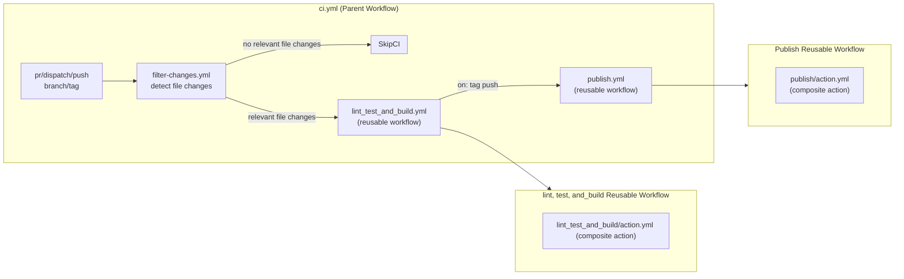

<a id="readme-top"></a>
[](https://github.com/arsalanshaikh13/Parallax-Provider-Tutorial/actions/workflows/ci.yml)

# parallax-provider-tutorial-library — CI/CD with GitHub Actions

> GitHub Actions setup: modular, reproducible, and fast. This README documents
> the architecture, the problems I hit, their root causes, the fixes, and the
> measured impact, lessons learned, best practices.

---

<!-- https://github.com/othneildrew/Best-README-Template/blob/main/README.md?plain=1 Best Readme Template -->
<details style="cursor:pointer">
  <summary style="font-size:1.5rem"><strong>Table of Contents</strong></summary>
  <ol>
    <li><a href="#overview">Overview</a></li>
    <li><a href="#goals">Goals</a></li>
    <li><a href="#what-i-implemented">What I Implemented</a></li>
    <li><a href="#architecture-decisions">Architecture Decisions</a></li>
    <li><a href="#impact-of-the-decisions">Impact of the Decisions</a></li>
    <li><a href="#root-cause-analysis-of-key-issues">Root Cause Analysis of Key Issues</li>
    <li><a href="#example-config-snippets">Example Config Snippets</a></li>
    <li><a href="#debug-checklist-commands">Debug Checklist / Commands</a></li>
    <li><a href="#best-practices--recommendations">Best Practices &amp; Recommendations</a></li>
    <li><a href="#results-of-the-fixes">Results of the Fixes</a></li>
    <li><a href="#common-errors-and-solutions">Common Errors and Solutions</a></li>
    <li><a href="#lessons-learned">Lessons Learned</a></li>
  </ol>
</details>

---

## Overview

I modularized a previously monolithic `ci.yml` into:

- **Reusable workflows** (in `.github/workflows`) for build/test/publish stages.
- **Composite actions** (in `.github/actions/*/action.yml`) for shared logic
  (e.g., Node setup + caching).
- **Dynamic control** via inputs/outputs to selectively run jobs based on
  changed files and pipeline parameters.
- **Secure secret & permission flow**: Explicit passing from caller → reusable
  workflow → composite actions, with minimal required permissions for write
  operations.
- **Performance optimizations**: Switched from Yarn cache to `node_modules`
  caching; tuned fetch depth; strict artifact sharing between jobs.
- **Developer feedback**: Automatic **Jest coverage report** posted to Job
  Summary & Pull Requests.

#### <p align="right">(<a style="cursor:pointer" href="#readme-top">back to top</a>)</p>

---

## Goals

- Scalability & maintainability via **modular pipeline** (small, focused files).
- Deterministic runs, **reproducible environments**, and explicit communication
  and permissions between workflows and jobs.
- Faster pipelines via **effective caching** and more control via **change
  detection**.
- Better developer UX: **coverage surfaced on PRs**, artifacts shared, and
  strict **status checks** gating merges.

## What I Implemented

- **Modularization**: Split monolith into reusable workflows + composite
  actions.
- **Inter-pipeline Communication**: Parent workflow passes **inputs & secrets**
  to reusable workflows; those forward inputs to composite actions. Steps emit
  outputs → jobs → workflow → parent via `needs.*.outputs`.
- **Selective Execution**: Trigger jobs only when relevant files change (custom
  `git diff` + regex).
- **Caching**: Cache **`node_modules`** instead of Yarn global cache using
  action `actions/cache@v4` .
- **Coverage Reporting**: `artiomTr/jest-coverage-action@v2` (requires write
  permissions for `checks`, `pull-requests`, and `contents`).
- **Branch Protections**: Require **lint_test_and_build** status to pass before
  merging.

#### <p align="right">(<a style="cursor:pointer" href="#readme-top">back to top</a>)</p>

---

## Architecture

#### Folder Layout

```
- .github
  - actions
    - publish
      - action.yml
    - test_and_build
      - action.yml
  - workflows
    - ci.yml
    - filter-changes.yml
    - publish.yml
    - test_and_build.yml
```

#### Flowchart



### Architecture Decisions

- **Why reusable workflows?** Clean separation of concerns and easier reuse
  across repos.
- **Why composite actions?** Share repeatable step blocks (checkout,Node setup,
  cache storing and retrieving, test,build, storing artifacts and retrieving
  artifacts ) without copy-pasting.
- **Why explicit secrets?** Reusable workflows **do not inherit**
  secrets/permissions; explicit flow is more secure and predictable.
- **Why `node_modules` cache?** Smaller, more deterministic across jobs than
  Yarn’s global cache for this project’s shape.

#### <p align="right">(<a style="cursor:pointer" href="#readme-top">back to top</a>)</p>

## Impact of the Decisions

| Optimization                 |              Before |                            After | Impact           |
| ---------------------------- | ------------------: | -------------------------------: | ---------------- |
| **Install time (deps load)** |                 17s |                           **9s** | −47%             |
| **Build stage total**        |                 34s |                          **22s** | −35%             |
| **Publish stage total**      |                 57s |                          **39s** | −32%             |
| **Cache size**               |      \~110MB (Yarn) |      **\~17MB** (`node_modules`) | −85%             |
| **Developer feedback**       | coverage local only | **coverage in PR & job summary** | Faster review    |
| **Maintainability**          |          monolithic |                      **modular** | Easier to evolve |

> Numbers are from repeated runs on the same repo, typical variance ±1–2s.

---

## Root Cause Analysis of Key Issues

| Problem                                             | Root Cause                                                                                                                 | Solution                                                                                              | Impact                                   |
| --------------------------------------------------- | -------------------------------------------------------------------------------------------------------------------------- | ----------------------------------------------------------------------------------------------------- | ---------------------------------------- |
| **Composite action couldn’t access secrets**        | Composite actions **never inherit** `secrets` or `env`, even within same repo                                              | Pass secrets **explicitly** as action inputs; forward them from caller → reusable → action            | Secure & predictable secret flow         |
| **Reusable workflow couldn’t write coverage to PR** | Reusable workflows **inherit permissions from caller**; default is **read-only** for `checks`, `pull-requests`, `contents` | Set `permissions` in **caller** workflow (`checks: write`, `pull-requests: write`, `contents: write`) | Coverage now appears on PR + job summary |
| **Change filters didn’t trigger jobs**              | Shallow clone + naive `git diff` against wrong base                                                                        | Fetch base ref, compute proper merge-base on PRs, use robust diff; emit outputs for `needs`           | Correctly skips/executes jobs            |
| **Cache restored inconsistently**                   | Cache key didn’t include lockfile hash                                                                                     | Cache key uses `hashFiles('**/package-lock.json')`                                                    | Reliable cache hits                      |
| **Cache restored inconsistently**                   | Cache key didn’t include lockfile hash                                                                                     | Cache key uses `hashFiles('**/package-lock.json')`                                                    | Reliable cache hits                      |

#### <p align="right">(<a style="cursor:pointer" href="#readme-top">back to top</a>)</p>

## Example Config Snippets

### 1) Parent caller workflow (`ci.yml`)

```yaml
name: Build, Test and Publish

on:
  repository_dispatch:
    types:
      - trigger-from-circleci
  workflow_dispatch:
  pull_request:
    branches:
      - main
  push:
    branches:
      - main
      # github actions does not take regex patterns but takes glob patterns
    tags:
      - 'v[0-9].[0-9]+.[0-9]+' # Trigger release when pushing tags like v1.0.0

jobs:
  filter-changes:
    uses: ./.github/workflows/filter-changes.yml

  test-and-build:
    # set permissions to avoid Resource integration error
    permissions:
      checks: write
      pull-requests: write
      contents: write
    # This job will only run if the 'filter-changes' job's output is 'true'.
    # This is the key to skipping the entire job on empty commits.
    needs: filter-changes
    if: needs.filter-changes.outputs.has_relevant_changes == 'true'
    uses: ./.github/workflows/test_and_build.yml
    secrets:
      secret_GITHUB_TOKEN: ${{secrets.GITHUB_TOKEN}}

  publish:
    needs: test-and-build
    if: startswith(github.ref, 'refs/tags/v') # only on version tags
    uses: ./.github/workflows/publish.yml
    secrets:
      NPM_TOKEN: ${{ secrets.NPM_TOKEN }}
```

### 2) Reusable workflow (`lint_test_and_build.yml`)

```yaml
name: Lint, Test, and Build

on:
  workflow_call:
    secrets:
      secret_GITHUB_TOKEN:
        required: true

jobs:
  test-and-build:
    runs-on: ubuntu-latest
    steps:
      - name: Checkout code
        uses: actions/checkout@v4

      - name: Setup, install,lint,test and build code
        uses: ./.github/actions/test_and_build
        with:
          secret_input_github_token: ${{secrets.secret_GITHUB_TOKEN}}
```

### 3) Composite action (`.github/actions/lint_test_and_build/action.yml`)

```yaml
name: Lint, Test and Build
inputs:
  secret_input_github_token:
    required: true

runs:
  using: 'composite'
  steps:
    # check for node_modules cache
    - name: Get node_modules
      uses: actions/cache@v4
      id: node_modules
      with:
        path: |
          **/node_modules
        # hashing yarn.lock to freeze package dependencies version and checking for those specific verison only
        # Adding node version as cache key
        key:
          ${{ runner.os }}-node_modules-${{ hashFiles('**/yarn.lock')
          }}-v18.20.8

      # setting up node only when cache-hit is false
    - name: Setup Node.js
      if: steps.node_modules.outputs.cache-hit != 'true'
      uses: actions/setup-node@v4
      with:
        node-version: 18.20.8

    - name: Install dependencies
      if: steps.node_modules.outputs.cache-hit != 'true'
      run: yarn install  --frozen-lockfile
      shell: bash

    - name: Lint
      run: yarn lint
      shell: bash

    - name: Test
      run: yarn test
      shell: bash

    - name: Build
      run: yarn build
      shell: bash

    - name: Jest Coverage Comment
      id: coverage
      uses: ArtiomTr/jest-coverage-report-action@v2
      with:
        github-token: ${{ inputs.secret_input_github_token }}
        annotations: all
        skip-step: all
        coverage-file: ${{github.workspace}}/coverage/report.json
        base-coverage-file: ${{github.workspace}}/coverage/report.json
        output: comment, report-markdown
        icons: emoji

    - name: Check the output coverage
      run: |
        echo "TEST RESULTS:" >> $GITHUB_STEP_SUMMARY
        echo "" >> $GITHUB_STEP_SUMMARY
        cat <<EOF >> "$GITHUB_STEP_SUMMARY"
        ${{ steps.coverage.outputs.report }}
        EOF
      shell: bash
      if: always()

    - name: Upload build artifacts (dist/)
      uses: actions/upload-artifact@v4
      with:
        name: dist
        path: dist/**
        if-no-files-found: error
        retention-days: 1 day
```

### 4) Custom file-change filter (git diff + regex)

If you want this as a **standalone composite action**:

```yaml
# .github/actions/changed-files-filter/action.yml
name: Changed Files Filter
inputs:
  base:
    required: false
  head:
    required: false
  pattern:
    required: true
runs:
  using: 'composite'
  steps:
    - shell: bash
      id: scan
      run: |
        BASE="${{ inputs.base || github.event.pull_request.base.sha || github.event.before }}"
        HEAD="${{ inputs.head || github.sha }}"
        if [ -z "$BASE" ]; then
          BASE=$(git rev-list --max-parents=0 HEAD | tail -n 1)
        fi
        git diff --name-only "$BASE" "$HEAD" > changed.txt
        if grep -E "${{ inputs.pattern }}" changed.txt >/dev/null; then
          echo "matched=true" >> "$GITHUB_OUTPUT"
        else
          echo "matched=false" >> "$GITHUB_OUTPUT"
        fi
outputs:
  matched:
    value: ${{ steps.scan.outputs.matched }}
```

### 5) Jest coverage report on PRs and job Summary

> Requires write permissions on the **caller** workflow (not inside the reusable
> workflow).

```yaml
- name: Jest Coverage Comment
      id: coverage
      uses: ArtiomTr/jest-coverage-report-action@v2
      with:
        github-token: ${{ inputs.secret_input_github_token }}
        annotations: all
        skip-step: all
        coverage-file: ${{github.workspace}}/coverage/report.json
        base-coverage-file: ${{github.workspace}}/coverage/report.json
        output: comment, report-markdown
        icons: emoji


- name: Check the output coverage
    run: |
        echo "TEST RESULTS:" >> $GITHUB_STEP_SUMMARY
        echo "" >> $GITHUB_STEP_SUMMARY
        cat <<EOF >> "$GITHUB_STEP_SUMMARY"
        ${{ steps.coverage.outputs.report }}
        EOF
        shell: bash
    if: always()

```

---

## Debug Checklist / Commands

- Confirm permissions at top level (caller):
  `permissions: { contents: write, checks: write, pull-requests: write }`
- Verify secrets are passed explicitly in `uses: ./.github/workflows/...` via
  `secrets:` and forwarded to composite actions as **inputs**.
- Ensure diff is correct:

  ```
  git --version
  git rev-parse HEAD
  echo "$BASE_SHA $HEAD_SHA"
  git diff --name-only "$BASE_SHA" "$HEAD_SHA"
  ```

- Cache keys: print them to logs to compare:

  ```
  echo "${{ runner.os }}-node-provider-${{ hashFiles('**/yarn.lock') }}"
  ```

- Artifact sanity:

  ```
  ls -la dist coverage
  ```

  #### <p align="right">(<a style="cursor:pointer" href="#readme-top">back to top</a>)</p>

---

## Best Practices & Recommendations

- **Folder rules**
  - Reusable workflows **must** live in `.github/workflows`.
  - Composite actions live in `.github/actions/<name>/action.yml` (or a
    dedicated repo—**one action per repo** when published).

- **Always call modular parts with `uses:`**; keep business logic out of the
  driver file.
- **Secrets & permissions**
  - Reusable workflows **do not inherit** secrets/permissions; define them in
    the **caller**.
  - Composite actions **never** see `secrets` implicitly—pass them as inputs.

- **Outputs plumbing**
  - Step `echo "output=<something>">> $GITHUB_OUTPUT` → Job
    (`outputs:steps.<step-id>.outputs.*`) → Reusable workflow
    (`outputs:jobs.<job>.outputs.*`) → Parent (`needs.<job>.outputs.*`).

- **Status checks**
  - Protect `main`: require **Test CI** to pass before merging PRs.

- **Performance**
  - Prefer `node_modules` cache for this repo over Yarn global cache.
  - Keep `fetch-depth: 0` for robust diffs for repeated rollbacks .

- **Artifacts**
  - Use `upload-artifact` / `download-artifact` to avoid rebuilding between
    jobs.
- **Cache key**
  - Use `cache key` to successfully and securely save and retrive the caches for
    node modules and yarn packages and since the hash key is based on yarn.lock
    file check for changes in the dependencies between the builds

---

## Results of the Fixes

- **Pipeline runtime** significantly reduced across stages.
- **Cache footprint** dropped from \~110MB (Yarn) to \~17MB (`node_modules`).
- **PR feedback loop** improved by showing coverage in both **Job Summary** and
  **PR**.
- **Maintainability**: A clean, modular layout makes it easy to evolve the
  pipeline.

#### <p align="right">(<a style="cursor:pointer" href="#readme-top">back to top</a>)</p>

---

## Common Errors and Solutions

| Error                                     | Why it happens                                 | Fix                                                                           |
| ----------------------------------------- | ---------------------------------------------- | ----------------------------------------------------------------------------- |
| `secrets.X not found` in composite action | Composite actions don’t inherit secrets        | Pass via action `inputs`; forward from caller → reusable → action             |
| Coverage not posted to PR                 | Caller workflow didn’t grant write permissions | Set at top of **caller**: `permissions: checks/pull-requests/contents: write` |
| Change filter never matches               | Wrong merge base or shallow clone              | Use `fetch-depth: 0` or fetch base; compute proper base SHA                   |
| Cache miss every run                      | Key doesn’t include lockfile hash              | Use `hashFiles('**/package-lock.json')` in key                                |
| Reusable workflow sees read-only token    | Permissions must be defined in caller          | Define `permissions:` in caller; reusable inherits                            |

---

## Lessons Learned

1. **Modularize early**: Reusable workflows + composite actions keep CI easy to
   reason about.
2. **Be explicit with secrets/permissions**: GitHub Actions won’t implicitly
   pass them to reusables/composites.
3. **Measure, then optimize**: Switching to `node_modules` cache provided real
   speed + size wins here.
4. **Surface developer feedback**: Coverage in PRs changes behavior—developers
   respond to what they can see.
5. **Guard the mainline**: Required status checks protect release quality with
   minimal friction.

#### <p align="right">(<a style="cursor:pointer" href="#readme-top">back to top</a>)</p>

---
