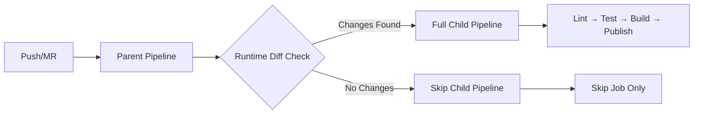

# Parallax Provider Tutorial Library — GitLab CI/CD README

[](https://docs.gitlab.com/ee/ci/)
[]()

A practical, **modular** GitLab CI/CD setup for fast, reliable builds—built
around **runtime file-diff gating**, **dynamic child pipelines**, and
**lightweight images**. This document explains **what problems we hit**, **why
they happened**, **how we fixed them**, and **what impact the fixes had**.

---

## Table of Contents

- [Overview](#overview)
- [Goals](#goals)
- [What I implemented](#what-i-implemented)
- [Architecture Decisions](#Architecture-Decisions)
- [Impact of the decisions](#impact-of-the-decisions)
- [GitLab CI: Problems, Root Causes, Solutions, Impacts](#GitLab-CI--Problems--Root-Causes--Solutions--Impacts)
- [Root Cause Analysis of Key Issues](#Root-Cause-Analysis-of-Key-Issues)
- [Example config snippets](#example-config-snippets)
- [Debug checklist / commands](#debug-checklist--commands)
- [Best practices & recommendations](#best-practices--recommendations)
- [Result of the fixes](#result-of-the-fixes)
- [Common errors and solutions](#common-errors-and-solutions)
- [Lessons Learned ](#Lessons-Learned)

---

## Overview

- **Modularized CI** into reusable templates so multiple workflows/projects can
  share the same jobs.
- **Downstream (parent/child) pipelines** decide at runtime whether to run a
  **full** workflow or an **empty** one (to avoid wasted runs).
- **Runtime git diff** in a **check** job (instead of `rules:changes`) to detect
  file changes robustly—even with shallow clones, force pushes, API-triggered
  pipelines, or all-zero SHAs.
- **Lightweight images** (`alpine`, `busybox`) wherever possible for faster
  spin-up.

---

## Goals

- **Speed:** minimal images, lean caches, fewer wasted jobs.
- **Reliability:** resilient to shallow history, force pushes, detached HEAD,
  and API triggers.
- **Maintainability:** modular job templates, fewer giant YAMLs, clear
  separation of concerns.
- **Scalability:** compose pipelines across branches/projects; reuse job blocks.
- **Determinism:** controlled caching, reproducible installs, explicit gating
  logic.

---

## What I implemented

### Solution Architecture

#### Core Innovation: Runtime Change Detection + Dynamic Pipeline Generation



### Key Components

1. **Smart Change Detection**: Runtime git analysis that handles edge cases
2. **Dynamic Pipeline Generation**: Parent/child pattern with conditional
   workflows
3. **Modular Templates**: Reusable job definitions across projects
4. **Optimized Artifacts**: Minimal dependencies and smart caching

---

## Architecture Decisions

### Why Parent/Child Pattern?

- **Compile-time limitations**: `rules:changes` fails with shallow clones
- **Resource efficiency**: Skip entire workflows, not individual jobs
- **Clear separation**: Decision logic isolated from execution logic

### Why Runtime Diff vs GitLab Rules?

- **Reliability**: Handles edge cases GitLab rules miss
- **Flexibility**: Custom change detection logic (file patterns, paths)
- **Debugging**: Explicit logs of what triggered execution

### Why Lightweight Images?

- **Speed**: `alpine:latest` (5MB) vs `ubuntu:latest` (72MB)
- **Cost**: Faster pulls reduce compute time
- **Security**: Smaller attack surface

---

## Impact of the decisions

- **Robust change detection** across pushing branches/tags and API triggers.
- **No more “bad object 000000…”** failures or broken `rules:changes`.
- **Zero flakiness** around `CI_COMMIT_BEFORE_SHA` and shallow clones.
- **Cleaner YAML** that scales across repos and branches.
- **Predictable child pipelines** (full/empty) with clear UI and messages.
- **Faster pipelines** (lighter images, fewer downloads, smarter cache).

---

## GitLab CI: Problems, Root Causes, Solutions, Impacts

### 1) `git diff` and `rules:changes` failed (all-zeros SHA, shallow clone, detached HEAD)

- **Problem:** Errors like `fatal: bad object 000000...` and “changes” rules not
  matching.
- **Root cause(s):**
  - `CI_COMMIT_BEFORE_SHA` is **all zeros** in some cases (first commit on
    branch, tag pipelines, API-triggered pipelines, mirrors, etc.).
  - Shallow clone (e.g., `GIT_DEPTH=20`) missing the base commit causes
    `git diff` or `merge-base` to fail.
  - GitLab runner checks out a **detached HEAD** by design, so branch pointers
    aren’t always available the way local workflows expect.

- **Solution(s) applied:**
  - Defensive diff logic in a **check job**:

    ```sh
    if [ "$CI_COMMIT_BEFORE_SHA" = "0000000000000000000000000000000000000000" ] || \
       ! git cat-file -e "$CI_COMMIT_BEFORE_SHA" 2>/dev/null; then
      CHANGED=$(git show --pretty="" --name-only "$CI_COMMIT_SHA" | grep -E '\.js$|\.json$|\.yml$|\..*rc$')
    else
      CHANGED=$(git diff --pretty="" --name-only "$CI_COMMIT_BEFORE_SHA" "$CI_COMMIT_SHA" | grep -E '\.js$|\.json$|\.yml$|\..*rc$')
    fi
    ```

  - (When needed) `git fetch --unshallow` or fetch the merge base explicitly.

- **Impact:** Robust change detection across pushes/tags/API triggers; no more
  “bad object” failures; “changes” logic is now under our control.

### 2) Dynamic child pipeline generation: YAML/heredoc and script file errors

- **Problems:**
  - `syntax error: unexpected end of file (expecting "fi")` when writing the
    dynamic config.
  - `.gitlab/generate-pipeline.sh: not found` even though the file existed.
  - “Unable to create pipeline: jobs include:\n - local config should implement
    the script, run, or trigger keyword”.

- **Causes:**
  - Indented/unquoted heredocs causing trailing spaces; missing closing `EOF`.
  - CRLF line endings in scripts (`\r\n`) on Linux shells.
  - The file we generated contained only `include:` at the top level but wasn’t
    **used via a trigger**; GitLab tried to interpret it as a **job**, hence the
    error.

- **Solutions applied:**
  - Use **quoted heredocs** with no indentation:

    ```sh
    cat <<'YAML' > .gitlab/pipeline-config.yml
    include:
      - local: '.gitlab/child-full.yml'
    YAML
    ```

  - Ensure scripts are executable **and** LF line endings:

    ```sh
    chmod +x .gitlab/generate-pipeline.sh
    sed -i 's/\r$//' .gitlab/generate-pipeline.sh  # or dos2unix
    ```

  - Trigger child pipeline correctly from the parent job:

    ```yaml
    trigger_child_pipeline:
      stage: trigger
      trigger:
        include:
          - artifact: .gitlab/pipeline-config.yml
            job: check_for_relevant_files
        strategy: depend
    ```

- **Impact:** Dynamic “full vs empty” child pipelines now load reliably; no
  heredoc/EOF errors; clean separation of logic (parent checks, child runs).

### 3) Artifacts auto-downloaded by later jobs

- **Problem:** `build` was pulling artifacts from `lint_and_test` even though
  not needed.
- **Cause:** Default artifact dependency behavior (or `needs:` without
  `artifacts: false`).
- **Solutions:**
  - `dependencies: []` **or**
  - `needs: [ { job: lint_and_test, artifacts: false } ]`

- **Impact:** Faster jobs, less network churn, cleaner pipeline.

### 4) Conditional artifacts / “don’t trigger if no changes”

- **Problem:** Trigger job still tried to run when there were no relevant
  changes.
- **Cause:** Artifacts are defined at job start; can’t put rules **inside**
  `artifacts`.
- **Solutions:**
  - Always generate `.gitlab/pipeline-config.yml` artifact, but write it to
    include **`child-empty.yml`** when no changes.
  - (Alternative) Split into two parent jobs with different rules; each
    generates a different artifact.

- **Impact:** Parent always succeeds; downstream behavior is controlled by the
  generated include.

## Root Cause Analysis of Key Issues

1. **`git diff` Failures**:
   - **Core Problem**: GitLab's pipeline event model inconsistency
   - **Hidden Culprit**: `CI_COMMIT_BEFORE_SHA` behaves differently for:
     - First branch push (zeros)
     - Tags (parent commit)
     - API triggers (may be absent)
   - **Solution Insight**: git diff/show approach handles GitLab's variable
     unreliability

2. **Child Pipeline Errors**:
   - **Fundamental Misalignment**: GitLab expects job definitions in triggered
     includes
   - **Key Insight**: `child-empty.yml` must contain valid jobs (even no-ops),
     not just workflow config

3. **Artifact Over-Download**:
   - **Systemic Issue**: GitLab's default artifact inheritance
   - **Performance Impact**: Unnecessary network I/O compounds in monorepos
   - **Key Insight**: implicit artifact dependencies or `needs:` without
     `artifacts: false`.

4. **Dynamic include & heredoc issues**
   - **Issue:** Indented/unquoted heredocs, missing `EOF`, CRLF endings.
   - **Insight** YAML parse errors ; child pipeline not created.

---

## Example config snippets

### Repo layout (modular templates)

```
.gitlab/
  build/
    build.yml
  lint_and_test/
    lint_and_test.yml
  release/
    release.yml
  child-pipeline/
    child-full.yml
    child-empty.yml
  generate-pipeline.sh
```

### Parent pipeline (`.gitlab-ci.yml`)

```yaml
image: alpine:latest

stages: [check, trigger]

workflow:
  rules:
    - if:
        '($CI_COMMIT_BRANCH == "gitlabci" || $CI_COMMIT_TAG) &&
        $CI_PIPELINE_SOURCE == "api"'
    - when: never

check_for_relevant_files:
  stage: check
  image: alpine:latest
  script:
    - apk add --no-cache git
    - chmod +x .gitlab/scripts/generate-pipeline.sh
    - .gitlab/scripts/generate-pipeline.sh
  artifacts:
    paths: [.gitlab/pipeline-config.yml]
    expire_in: 10 min

trigger_child_pipeline:
  stage: trigger
  trigger:
    include:
      - artifact: .gitlab/pipeline-config.yml
        job: check_for_relevant_files
    strategy: depend
```

### `generate-pipeline.sh` (runtime diff → decide full/empty)

```sh
#!/usr/bin/env sh
set -eu

# Detect changed files (fallback when BEFORE_SHA is zeros or missing)
if [ "${CI_COMMIT_BEFORE_SHA:-0000000000000000000000000000000000000000}" = "0000000000000000000000000000000000000000" ] || \
   ! git cat-file -e "$CI_COMMIT_BEFORE_SHA" 2>/dev/null; then
  CHANGED=$(git show --pretty="" --name-only "$CI_COMMIT_SHA" | grep -E '\.js$|\.json$|\.yml$|\..*rc$' || true)
else
  CHANGED=$(git diff --pretty="" --name-only "$CI_COMMIT_BEFORE_SHA" "$CI_COMMIT_SHA" | grep -E '\.js$|\.json$|\.yml$|\..*rc$' || true)
fi

mkdir -p .gitlab

if [ -z "$CHANGED" ]; then
  printf "No relevant changes — generating EMPTY pipeline.\n"
  cat <<'YAML' > .gitlab/pipeline-config.yml
include:
  - local: '.gitlab/child-empty.yml'
YAML
else
  printf "Found relevant changes:\n%s\n" "$CHANGED"
  cat <<'YAML' > .gitlab/pipeline-config.yml
include:
  - local: '.gitlab/child-full.yml'
YAML
fi
```

### Child (full) `.gitlab/child-full.yml`

```yaml
image: node:18-alpine

stages: [test, build, release]

# Cache (prefer Yarn cache; pull-only here)
.cache_common: &cache_common
  key: yarn-cache
  paths:
    - /root/.cache/yarn/

lint_and_test:
  stage: test
  cache:
    <<: *cache_common
    policy: pull
  script:
    - yarn install --frozen-lockfile --ignore-scripts
    - yarn lint
    - yarn test
  artifacts:
    when: always
    reports:
      # Prefer Cobertura from Jest: jest --coverage --coverageReporters=cobertura
      # coverage_report:
      #   coverage_format: cobertura
      #   path: coverage/cobertura-coverage.xml
    paths:
      - coverage/
    expire_in: 1 week

build:
  stage: build
  needs: [{job: lint_and_test, artifacts: false}]
  cache:
    <<: *cache_common
    policy: pull
  script:
    - yarn install --frozen-lockfile --ignore-scripts
    - yarn build
  artifacts:
    paths: [dist/]
    expire_in: 1 week

release:
  stage: release
  needs: [{job: build, artifacts: true}]
  rules:
    - if: '$CI_COMMIT_TAG =~ /^v[0-9]+\.[0-9]+\.[0-9]-gitlabci\.[0-9]+$/'
      when: on_success
    - when: never
  script:
    # Option A: publish from dist/ to avoid lifecycle scripts entirely
    - echo "//registry.npmjs.org/:_authToken=$NPM_TOKEN" > ~/.npmrc
    - cp package.json dist/
    - cd dist
    - npm publish --access public
```

### Child (empty) `.gitlab/child-empty.yml`

```yaml
image: busybox:latest

stages: [skip]

skip_job:
  stage: skip
  script:
    - echo "No relevant changes — skipping downstream jobs."
```

---

## Debug checklist / commands

```bash
# See env quickly
printenv | sort

# Where am I / what files exist?
pwd && ls -la && ls -la .gitlab || echo "no .gitlab"

# Show 20 commits
git log --oneline -n 20

# Inspect SHAs
echo "CI_COMMIT_SHA=$CI_COMMIT_SHA"
echo "CI_COMMIT_BEFORE_SHA=$CI_COMMIT_BEFORE_SHA"
git cat-file -e "$CI_COMMIT_BEFORE_SHA" 2>/dev/null && echo "before exists" || echo "before missing/zeros"

# Fallback change detection
git show --pretty="" --name-only "$CI_COMMIT_SHA"
git diff --pretty="" --name-only "$CI_COMMIT_BEFORE_SHA" "$CI_COMMIT_SHA"

# Fix CRLF on scripts
sed -i 's/\r$//' .gitlab/scripts/*.sh
chmod +x .gitlab/scripts/*.sh
```

---

## Best practices & recommendations

- **Permissions:** grant “Maintainer”/owner rights to set CI/CD variables before
  relying on them.
- **Rules parity:** if a job with `needs:` has `rules`, ensure **upstream** jobs
  have **compatible rules**, or GitLab may not schedule as expected.
- **Modularization:** split monolithic YAML; one file per reusable job. Keep
  shared anchors in a dedicated include.
- **Compile-time vs run-time:** `rules`, `parameters`, and keywords evaluate at
  **compile time**; **only `script:`** runs at **run time**. Use a **dynamic
  child pipeline** when you must decide based on run-time info.
- **Heredocs:** prefer external `*.sh` files to avoid YAML indentation pitfalls.
- **Images:** `busybox` for “empty” child, `alpine` for shell + git,
  `node:alpine` only when Node is needed.
- **Artifacts:** opt out with `needs: { artifacts: false }` or
  `dependencies: []` to prevent implicit downloads.

---

## Common errors and solutions

| Error / Symptom                                                              | Root Cause                                                 | Fix                                                       |
| ---------------------------------------------------------------------------- | ---------------------------------------------------------- | --------------------------------------------------------- |
| `fatal: bad object 000000...`                                                | `CI_COMMIT_BEFORE_SHA` is set all zeros or shallow history | Use `git show`                                            |
| `syntax error: unexpected end of file (expecting "fi")`                      | Indented/unquoted heredoc / CRLF                           | Use quoted heredocs or external `*.sh`; ensure LF endings |
| “Unable to create pipeline: include must implement script/run/trigger”       | Wrote `include:` but didn’t trigger a child                | Use parent job with `trigger: include: artifact:`         |
| Child “skip” job failed with `unknown failure` when using `when: on_failure` | Misapplied `when:` semantics in child                      | Remove `when: on_failure`; just print and exit 0          |
| Unwanted artifact downloads                                                  | Implicit dependencies                                      | `needs: { artifacts: false }` or `dependencies: []`       |
| Coverage report rejected                                                     | Clover not supported in `coverage_report`                  | Export Cobertura from Jest, or use `coverage:` regex      |
| Cache upload slow for tiny files                                             | TLS/zip overhead dominates                                 | Avoid caching tiny/low-value artifacts; prefer Yarn cache |

---

---

## Lessons Learned

### What Worked Exceptionally Well

- **Runtime Decision Making:** More reliable than compile-time rules
- **Gradual Adoption:** Reduced risk of trying new methods and increased buy-in

### Key Technical Insights

- **GitLab's SHA Behavior:** Inconsistent across trigger types, requires
  defensive programming
- **Artifact Strategy:** Explicit opt-out more reliable than implicit
  inheritance
- **Image Optimization:** 80% of speed gains from smaller base images

### Closing notes

This README documents the practical issues I hit while building a real
modular/dynamic Gitlab CI pipeline and the applied engineering fixes. The fixes
are small but crucial together they turn the dynamic configuration pattern from
fragile into reliable.

---
