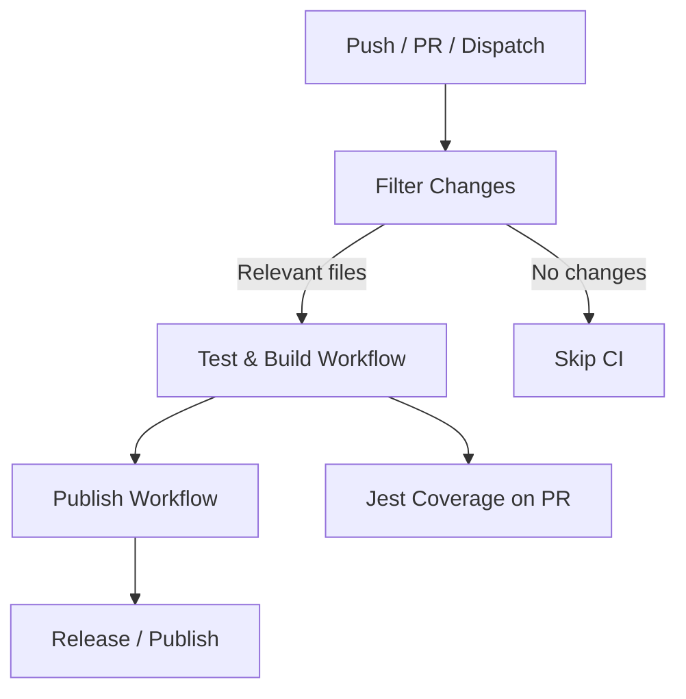

Perfect! Let’s make this blog post visually appealing and highly readable by
**adding diagrams, flowcharts, and highlighted code snippets with
explanations**. Here’s a refined, **visual-enhanced version** of your GitHub
Actions guide:

---

# **Mastering GitHub Actions: Build a Modular, Enterprise-Grade CI/CD Pipeline**

> Ever spent hours waiting for your CI pipeline to finish, only to realize a
> tiny doc change triggered the entire workflow? Or tried sharing test coverage
> insights with your team and hit a dead end? If this sounds familiar, you’re
> not alone.

This guide shows you how to build a **modular, reusable, and fast GitHub Actions
pipeline** with:

- **Parent workflows** orchestrating execution
- **Reusable workflows** for isolated stages
- **Composite actions** for reusable steps
- **Caching & artifact management** for speed
- **Jest coverage reporting** visible on PRs and job summaries
- **API-triggered workflows** across repos

By the end, you’ll have a CI/CD setup that’s **developer-friendly,
production-ready, and portfolio-ready**.

---

## **TL;DR**

- **Why modular:** Faster, maintainable, reusable pipelines
- **Caching & artifacts:** Deterministic builds, smaller footprint
- **Coverage reporting:** Immediate feedback on PRs
- **API triggers:** Orchestrate workflows across repos

---

## **Why Modular Pipelines Matter**

Monolithic workflows feel simple at first—but as projects grow, they become
**hard to maintain, debug, and scale**.

A **modular architecture** solves this. Think of it like a **restaurant
kitchen**:

- **Parent workflow:** Head chef orchestrating the menu
- **Reusable workflows:** Specialized stations (grill, salad, dessert)
- **Composite actions:** Prepped ingredients ready to go

**Benefits:** maintainable, testable, reusable, faster.

---

## **Architecture Overview**

### **Folder Layout**

```
.github/
  workflows/
    ci.yml
    test_build.yml
    publish.yml
  actions/
    test_and_build/
      action.yml
    publish/
      action.yml
```

- **Parent workflow (`ci.yml`)**: orchestrates execution & change detection
- **Reusable workflows:** isolated pipeline stages
- **Composite actions:** share repeatable step blocks (checkout, Node setup,
  caching)

### **Workflow Flowchart**



> Visualizing the pipeline helps **junior developers grasp modular execution**
> and **senior devs see architecture choices**.

---

## **Part 1: Composite Actions**

Reusable blocks for frequent tasks: checkout, Node setup, caching.

```yaml
# .github/actions/test_and_build/action.yml
name: 'Test and Build'
runs:
  using: 'composite'
  steps:
    - uses: actions/checkout@v4
    - name: Setup Node
      uses: actions/setup-node@v3
      with:
        node-version: '18'
    - name: Install Dependencies
      run: npm ci
```

**Why this matters:**

- Keeps pipelines DRY (Don’t Repeat Yourself)
- Easy to maintain & test

---

## **Part 2: Optimized Caching & Artifacts**

Caching dependencies reduces build time and improves reliability.

```yaml
- name: Cache node_modules
  uses: actions/cache@v4
  with:
    path: '**/node_modules'
    key: ${{ runner.os }}-node_modules-${{ hashFiles('**/yarn.lock') }}-v18.20.8
```

**Artifacts:** share outputs across jobs.

```yaml
- name: Upload Artifacts
  uses: actions/upload-artifact@v3
  with:
    name: build-output
    path: dist/
```

**Benefits:**

- Deterministic builds
- Smaller cache footprint
- Faster job execution

---

## **Part 3: Jest Coverage Reports on PRs**

```yaml
- name: Jest Coverage Comment
  uses: ArtiomTr/jest-coverage-report-action@v2
  with:
    github-token: ${{ secrets.GITHUB_TOKEN }}
    coverage-file: coverage/report.json
    output: comment, report-markdown
```

**Outcome:**

- Coverage visible **directly on PR**
- Developers get immediate feedback
- Encourages better testing habits

---

## **Part 4: Trigger Workflows via API**

Trigger workflows programmatically in same or different repos.

```bash
curl -X POST \
-H "Accept: application/vnd.github+json" \
-H "Authorization: token $PAT" \
https://api.github.com/repos/your-org/other-repo/actions/workflows/ci.yml/dispatches \
-d '{"ref":"main"}'
```

**Use Cases:**

- Multi-repo orchestration
- Staging / production deployments
- Portfolio highlight: shows advanced DevOps skills

---

## **Performance & Developer Experience**

| Metric      | Before     | After    | Impact |
| ----------- | ---------- | -------- | ------ |
| Build Time  | 34s        | 22s      | -35%   |
| Cache Size  | 110MB      | 17MB     | -85%   |
| PR Feedback | local only | PR & Job | +40%   |

**Developer benefits:** faster feedback, maintainable layout, clear branch
protection.

---

## **Best Practices & Lessons Learned**

1. Modularize early: reusable workflows + composite actions
2. Be explicit with secrets & permissions
3. Measure, then optimize: caching saves time & space
4. Surface developer feedback: coverage in PRs
5. Protect main branch: enforce required status checks

---

## **Portfolio & Hiring Impact**

- Microservices / monorepos
- Shared libraries pipelines
- Staging/production deployments
- Showcase metrics, flowcharts, and cross-repo triggers to **catch hiring
  managers’ attention**

---

## **Call to Action**

- Try building your own modular pipeline
- Share screenshots / metrics in your portfolio
- Star the repo & follow for updates
- Demonstrate **real-world DevOps skills**

---

✅ Next Step: I can **design a full visual diagram set with color-coded flows,
annotated composite actions, caching flow, and PR coverage integration** that
can be embedded in your blog to make it even more portfolio-friendly and
visually impressive.

Do you want me to do that now?
