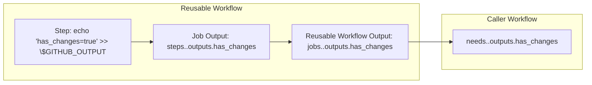

# Building Production-Grade GitHub Actions Pipelines: A Complete Developer's Guide

## Introduction

After wrestling with a monolithic 100+ line GitHub Actions workflow that ran on
every change (including documentation updates), I rebuilt our entire CI/CD
pipeline using advanced modular patterns. This guide shares the architecture,
performance optimizations, and critical insights I discovered along the way.

**What You'll Learn:**

- How to build modular, reusable GitHub Actions pipelines
- Advanced techniques for change detection, caching, and secret management
- Performance optimizations that reduced our pipeline time by 47%
- Production-ready patterns used by enterprise teams

## The Problem: When Monolithic Workflows Break Down

### Initial State

```yaml
# What we started with - the monolithic approach
name: Everything Pipeline
on: [push, pull_request]
jobs:
  build-test-deploy:
    runs-on: ubuntu-latest
    steps:
      # 100+ steps doing everything
      # No conditional execution
      # Poor caching strategy
      # No modular components
```

**Pain Points:**

- Pipeline ran for documentation changes (wasted compute)
- 17-second dependency installation every time
- No test coverage visibility during code review
- Debugging failures in a massive YAML file was nightmare
- Impossible to reuse logic across projects

## Solution Architecture: The Three-Tier Modular System

### Architecture Overview

```
├── .github/
│   ├── workflows/           # Orchestration Layer
│   │   ├── ci.yml          # Parent workflow (decision maker)
│   │   ├── filter-changes.yml  # Smart change detection
│   │   ├── test-build.yml     # Test and build pipeline
│   │   └── publish.yml        # Release pipeline
│   └── actions/            # Execution Layer
│       ├── test_and_build/    # Composite action
│       └── publish/           # Composite action
```

### Component Responsibilities

| Component              | Purpose                                                                                                             | Benefit                                  |
| ---------------------- | ------------------------------------------------------------------------------------------------------------------- | ---------------------------------------- |
| **Parent Workflow**    | Orchestrates execution and change detection of relevant files                                                       | Run workflows on relevant file changes   |
| **Reusable Workflows** | Clean separation of concerns; isolated, testable pipeline stages                                                    | Consistent and easier reuse across repos |
| **Composite Actions**  | Share repeatable step blocks (e.g., checkout, Node setup, cache storing/retrieving, test, build, artifact handling) | Reduced duplication                      |

#### 💡 Why Modular Workflows Matter

- **Maintainability** → clear separation of concerns to monitor and fix relevant
  pieces in their respective workflow or actions in isolation without searching
  through the other workflow jobs.
- **Reusability** → share common steps across projects.
- **Scalability** → add new features (like coverage reports or artifact
  handling) in a new workflow/actions and call and in the respective caller
  workflow.

## Implementation Deep Dive

### 1. The Secret and input Passing Chain: Understanding GitHub Actions communication

**Critical Insight**: GitHub Actions has strict security isolation:

- Reusable workflows DON'T inherit secrets from callers
- Composite actions NEVER see secrets implicitly
- All secret passing must be explicit
- pass secrets into reusable workflow using `secrets` key and any variables /
  parameters using `with` key
- pass secrets , variables, parameters into composite action as a input using
  `with` key , theres is no secrets key option in actions

**Implementation Pattern:**

```yaml
# Parent workflow (.github/workflows/ci.yml)
jobs:
# This job runs tests and builds the project.
  test-and-build:
    # Reuses a separate workflow file for the test and build logic.
    uses: ./.github/workflows/test_and_build.yml
    # passing the secrets into reusable workflow
    secrets:
      secret_GITHUB_TOKEN: ${{secrets.GITHUB_TOKEN}}

# Reusable workflow (.github/workflows/test-build.yml)
name: Lint, Test, and Build

# This defines the workflow as a reusable workflow that can be called by other workflows.
on:
  workflow_call:
    # Specifies the secrets that must be passed in when this workflow is called.
    secrets:
      secret_GITHUB_TOKEN:
        required: true

jobs:
  test-build:
    - name: Setup, install, lint, test and build code
      # This step calls a custom composite action located in the local repository.
      # This promotes code reuse and keeps the main workflow file clean.
      uses: ./.github/actions/test_and_build
      with:
        # Passes the required secret as input to the composite action.
        secret_input_github_token: ${{secrets.secret_GITHUB_TOKEN}}

# Composite action (.github/actions/test_and_build/action.yml)
name: lint, test and build
# Defines the inputs that this action accepts.
inputs:
  secret_input_github_token:
    required: true

# Specifies that this is a composite run action, which combines multiple steps into a single reusable action.
runs:
  using: 'composite'
  steps:
      # This action generates a code coverage report and adds it as a comment on the pull request.
    - name: Generate coverage report
      uses: ArtiomTr/jest-coverage-report-action@v2
      with:
        github-token: ${{ inputs.secret_input_github_token }}
```

> these are just the some important snippets from the code for full code review
> visit the repo at:
> https://github.com/arsalanshaikh13/Parallax-Provider-Tutorial/tree/main/.github/workflows

### 2. Output Flow: From Steps in reusable workflow to Conditional Execution of job in parent caller workflow

**Critical Insight**: In order to get the output from the reusable workflow to
run the job conditionally in parent caller workflow we have to follow:

- **The Chain**: Step Output → Job Output → Workflow Output → Parent
  Conditional.

* Code snippet for the implementation inside reusable
  workflow(.github/workflows/filter-changes.yml)

**Step level**

```yaml
jobs:
  filter-changes:
    steps:
      - id: check-changes
        run: echo "has_changes=true" >> $GITHUB_OUTPUT
```

**Job level**

```yaml
jobs:
  filter-changes:
    outputs:
      has_relevant_changes: ${{ steps.check-changes.outputs.has_changes }}
```

**Workflow level**

```yaml
on:
  workflow_call:
    outputs:
      has_relevant_changes:
        value: ${{ jobs.filter-changes.outputs.has_relevant_changes }
```

- Code snippet for the implementation inside parent workflow for conditional
  execution (.github/workflows/ci.yml)

```yaml
jobs:
  test-and-build:
    needs: filter-changes
    if: needs.filter-changes.outputs.has_relevant_changes == 'true'
```

output flow:



> the full implementation of the output flow is shown under "3. change detection
> in the files" below

### 3. Change Detection in the files

**Problem**: GitHub's native `paths` filter works fine on normal pushes but not
reliable on force pushes, rollbacks, and rebases.

**Solution**: Custom git diff with explicit commit comparison

**Implementation**: ( this snippet also has full implementation output flow)

```yaml
# normally try this solution initially to detect changes it will work fine on normal pushes but on rollbacks, rebases, resets it may or may not work reliably
# implementing this solution will not require the implementation of the alternative filter-changes job
# in order to make this solution work write branches and paths in the same order to below
# .github/workflows/ci.yml
on:
  push:
    branches:
      - main
    paths:
      - '**.json'
      - '**.js'
      - '**/package.json'
      - '**/yarn.lock'
      - '**.*rc'
      - '**.yml'
# if paths filter solution doesn't work then alternatively try this solution which will reliably work on any cases
# .github/workflows/ci.yml
on:
  push:
    branches:
      - main
jobs:
  # call the reusable workflow in ci.yml
  filter-changes:
    uses: ./.github/workflows/filter-changes.yml

# .github/workflows/filter-changes.yml
# A short and descriptive name for the Reusable workflow.
name: Filter Changes
# This allows the workflow to be called and reused by other workflows.
on:
  workflow_call:
    outputs:
      # Defines a descriptive output to check if relevant files were changed.
      has_relevant_changes:
        description: 'Check whether relevant files changed'
        value: ${{ jobs.filter-changes.outputs.has_relevant_changes }}

# Defines the single job in this workflow.
jobs:
  filter-changes:
    # Specifies the type of runner the job will use.
    runs-on: ubuntu-latest
    outputs:
      # Sets the output value for this job, which is the result from the 'check-changes' step.
      has_relevant_changes: ${{ steps.check-changes.outputs.has_changes }}
    steps:
      - name: Checkout code
        # Uses the 'actions/checkout' action to get a copy of the repository's code.
        uses: actions/checkout@v4
        with:
          # fetch current and previous / parent commit which is needed for comparison
          fetch-depth: 2

      - name: Check for relevant file changes
        # Assigns an ID to this step so its output can be referenced later.
        id: check-changes
        run: |
          # The 'set +e' command prevents the script from exiting immediately if a command fails.
          set +e
          # Uses 'git diff' to find the names of files that have changed between the current and previous commit.
          # The output is piped to 'grep' to filter for specific file extensions like .js, .json, etc.
          changed_files=$(git diff --name-only  HEAD^ ${{ github.sha }} 2>&1 | grep -E '\.js$|\.json$|\.yml$|\.lock$|\..*rc$')
          echo $changed_files output
          # An 'if' condition checks if the 'changed_files' variable is not empty.
          if [ -n "$changed_files" ]; then
            echo "Relevant files have been changed."
            # Sets the 'has_changes' output to 'true' if changes are found.
            echo "has_changes=true" >> $GITHUB_OUTPUT
          else
            echo "No relevant files were changed. Skipping subsequent jobs."
            # Sets the 'has_changes' output to 'false' if no relevant changes are found.
            echo "has_changes=false" >> $GITHUB_OUTPUT
          fi
```

> these are just the some important snippets from the code for full code review
> visit the repo at:
> https://github.com/arsalanshaikh13/Parallax-Provider-Tutorial/tree/main/.github/workflows

**Why the alternate solution Works:**

- **Explicit commit comparison** handles all git scenarios (rollbacks, force
  pushes, rebases)
- **fetch-depth: 2** ensures we always have the parent commit
- **Targeted file filtering** focuses on files that actually affect builds
- **Performance impact**: 80% reduction in unnecessary job runs

### 4. Advanced Caching Strategy: From 110MB to 17MB

**The Problem with Yarn Cache:** Even with Yarn's global cache, you still need
to:

- Install dependencies (package resolution) which Links dependencies to specific
  Node.js versions

**The node_modules Solution:**

```yaml
# .github/actions/test_and_build/action.yml

# This step checks for a cached 'node_modules' directory to speed up the workflow.
- name: Get node_modules
  # The 'actions/cache' action handles caching and restoring files.
  uses: actions/cache@v4
  id: node_modules
  with:
    # The path to the directory that will be cached.
    path: |
      **/node_modules
    # The cache key is generated from the runner's OS, a fixed string, and a hash of the 'yarn.lock' file and node version used.
    # This ensures the cache is unique to the dependencies and the runner environment.
    key: ${{ runner.os }}-node_modules-${{ hashFiles('**/yarn.lock') }}-v18.20.8

# This step only runs if the cache was not found in the previous step.
- name: Setup Node.js
  if: steps.node_modules.outputs.cache-hit != 'true'
  # Uses the 'actions/setup-node' action to set up the specified Node.js version.
  uses: actions/setup-node@v4
  with:
    node-version: 18.20.8

# This step installs the project dependencies using yarn.
# It also only runs if the cache was not found, as there's no need to install if the cache is restored.
- name: Install dependencies
  if: steps.node_modules.outputs.cache-hit != 'true'
  run: yarn install  --frozen-lockfile
  shell: bash
```

**Why this Works:**

- the actions/cache saves and restore the node modules cache
- the setup node and installing dependencies steps only run when the cache is
  not found **Performance Results:**

- **Cache size**: 110MB → 17MB (85% reduction)
- **Install time**: 17s → 9s (47% improvement) as install step is completely
  skipped
- **Deterministic restoration**: No package resolution overhead and linking
  dependencies

### 5. Artifact Management: Efficient Job-to-Job Data Transfer

**Problem**: every job in github actions run in a separate fresh container and
do not implicitly inherit any files from the previous job **Solution**: pass the
relevant files as an artifact between jobs by uploading and downloading
artifacts

```yaml
# Producer job
- name: Upload build artifacts
  uses: actions/upload-artifact@v4
  with:
    name: build-${{ github.sha }}
    path: |
      dist/**
    if-no-files-found: error
    retention-days: 30

# Consumer job
- name: Download build artifacts (dist/)
  uses: actions/download-artifact@v4
  with:
    name: dist
    path: dist/
    if-no-files-found: error
```

> these are just the some important snippets from the code for full code review
> visit the repo at:
> https://github.com/arsalanshaikh13/Parallax-Provider-Tutorial/tree/main/.github/workflows

**Best Practices:**

- Use unique artifact names (`build-${{ github.sha }}`)
- Set appropriate retention periods
- throw error when files are not found
- Include all necessary files for downstream jobs

## Performance Optimization Results

### Measurable Improvements

| Optimization                  |         Before |                       After | Impact           |
| ----------------------------- | -------------: | --------------------------: | ---------------- |
| **Install time (deps load)**  |            17s |                      **9s** | −47%             |
| **Build stage total**         |            34s |                     **22s** | −35%             |
| **Publish stage total**       |            57s |                     **39s** | −32%             |
| **Non relevant file Changes** |            34s |                      **7s** | -80%             |
| **Cache size**                | \~110MB (Yarn) | **\~17MB** (`node_modules`) | −85%             |
| **Maintainability**           |     monolithic |                 **modular** | Easier to evolve |

> Numbers are from repeated runs on the same repo, typical variance ±1–2s.

### Developer Experience Enhancements

- **Automated coverage reports** in pull requests
- **Immediate feedback** for non-code changes
- **Clear pipeline status** with descriptive job names
- **Protected branches** with required status checks

## Critical Insights & Lessons Learned

### 1. GitHub Actions Security Model

**Key Learning**: Security isolation is by design, not by accident.

- Explicit permission declaration at every level
- Secret passing must be intentional and documented
- Minimal required permissions principle

### 2. Performance Optimization Strategies

**Critical Insight**: Measure before optimizing.

- node_modules caching beats global package caches for deterministic builds
- Change detection saves more resources than any other optimization
- Cache key strategy directly impacts hit rates

### 3. Architecture Decision Framework

**Decision Process**: Always ask "What problem does this solve?"

- **Modular design** → Maintainability and reusability
- **Explicit communication** → Security and predictability
- **Conditional execution** → Performance and cost optimization

### Common Issues and Root Causes

| Error                    | Root Cause                              | Solution                                       |
| ------------------------ | --------------------------------------- | ---------------------------------------------- |
| `secrets.X not found`    | Composite actions don't inherit secrets | Pass via inputs explicitly                     |
| Coverage not in PR       | Missing write permissions               | Add `permissions:` to caller workflow          |
| Change detection fails   | Shallow clone issues                    | Use `fetch-depth: 2`                           |
| Tag push rollback issues | Git tag references persist              | Force reset → push previous → new commit + tag |

## Best Practices & Recommendations

### Architectural Guidelines

1. **Modularize Early**: Start with reusable components from day one
2. **Be Explicit**: Never rely on implicit behavior for secrets/permissions
3. **Measure Impact**: Quantify optimizations with real metrics
4. **Guard Quality**: Use required status checks on protected branches

### Performance Optimization

1. **Cache Strategy**: Choose caching approach based on your dependency
   management
2. **Change Detection**: Implement smart filtering for relevant files
3. **Parallel Execution**: Use job dependencies strategically
4. **Resource Management**: Set appropriate artifact retention periods

### Security Considerations

1. **Minimal Permissions**: Grant only what each component needs
2. **Explicit Secret Flow**: Document and validate secret passing chains
3. **Regular Audits**: Review permissions and access patterns periodically

## Conclusion

This modular GitHub Actions architecture transformed our development workflow
from a maintenance burden into a competitive advantage. The key insights:

1. **Architecture Matters**: Modular design enables scalability and
   maintainability
2. **Performance Optimization**: Measured improvements deliver real value
3. **Security by Design**: Explicit patterns prevent common vulnerabilities
4. **Developer Experience**: Good tooling improves team productivity

The patterns demonstrated here scale from personal projects to enterprise
environments, providing a foundation for production-grade CI/CD pipelines.

## Technical Skills Demonstrated

- **Advanced GitHub Actions**: Workflow orchestration, reusable components,
  security patterns
- **Performance Engineering**: Cache optimization, conditional execution,
  resource management
- **DevOps Architecture**: Modular system design, pipeline optimization
- **Problem Solving**: Root cause analysis, systematic debugging approaches
- **Documentation**: Technical communication, knowledge transfer

This implementation showcases the ability to design, optimize, and maintain
complex CI/CD systems that deliver measurable business value while maintaining
security and reliability standards.
