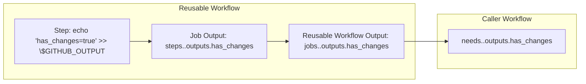

# Building GitHub Actions Pipelines: A Complete Developer's Guide

## Introduction

After wrestling with a monolithic 100+ line GitHub Actions workflow that ran on
every change (including documentation updates), I rebuilt our entire CI/CD
pipeline using advanced modular patterns. This guide shares the architecture,
performance optimizations, and critical insights I discovered along the way.

**What You'll Learn:**

- How to build modular, reusable GitHub Actions pipelines
- Advanced techniques for change detection, caching, and secret management
- Performance optimizations that reduced our pipeline time by 47%
- Production-ready patterns used by enterprise teams

## About This Guide

This Guide demonstrates GitHub Actions CI patterns using a JavaScript project as
an example. All project related configurations are framework-agnostic and can be
adapted to any tech stack by substituting the relevant commands and file
patterns shown throughout.

## The Problem: When Monolithic Workflows Break Down

### Initial State

```yaml
# What we started with - the monolithic approach
name: Everything Pipeline
on: [push, pull_request]
jobs:
  build-test-deploy:
    runs-on: ubuntu-latest
    steps:
      # 100+ steps doing everything
      # Repetitive conditional execution
      # Poor caching strategy
      # No modular components
```

**Pain Points:**

- Pipeline ran for documentation changes (wasted compute)
- 17-second dependency installation every time
- No test coverage visibility during code review
- Debugging failures in a massive YAML file was nightmare
- Impossible to reuse logic across projects

## Solution Architecture: The Three-Tier Modular System

### Architecture Overview

```
├── .github/
│   ├── workflows/           # Orchestration Layer
│   │   ├── ci.yml          # Parent workflow (decision maker)
│   │   ├── filter-changes.yml  # Smart change detection
│   │   ├── test-build.yml     # Test and build pipeline
│   │   └── publish.yml        # Release pipeline
│   └── actions/            # Execution Layer
│       ├── test_and_build/    # Composite action
│       └── publish/           # Composite action
```

### Component Responsibilities

| Component              | Purpose                                                                                                             | Benefit                                  |
| ---------------------- | ------------------------------------------------------------------------------------------------------------------- | ---------------------------------------- |
| **Parent Workflow**    | Orchestrates execution and change detection of relevant files                                                       | Run workflows on relevant file changes   |
| **Reusable Workflows** | Clean separation of concerns; isolated, testable pipeline stages                                                    | Consistent and easier reuse across repos |
| **Composite Actions**  | Share repeatable step blocks (e.g., checkout, Node setup, cache storing/retrieving, test, build, artifact handling) | Reduced duplication                      |

#### Why Modular Workflows Matter

- **Maintainability** → clear separation of concerns to monitor and fix relevant
  pieces in their respective workflow or actions in isolation without searching
  through the other workflow jobs.
- **Reusability** → share common steps across projects.
- **Scalability** → add new features (like coverage reports or artifact
  handling) in a new workflow/actions and call and in the respective caller
  workflow.

## Implementation Deep Dive

### 1. Understanding GitHub Actions communication between jobs

- Reusable workflows DON'T inherit secrets from callers
- Composite actions NEVER see secrets implicitly
- All secret passing must be explicit
- pass secrets into reusable workflow using `secrets` key and any variables /
  parameters using `with` key
- pass secrets , variables, parameters into composite action as a input using
  `with` key , theres is no secrets key option in actions

**Implementation Pattern:**

```yaml
# Parent workflow (.github/workflows/ci.yml)
jobs:
# This job runs tests and builds the project.
  test-and-build:
    # Reuses a separate workflow file for the test and build logic.
    uses: ./.github/workflows/test_and_build.yml
    # passing the secrets into reusable workflow
    secrets:
      secret_GITHUB_TOKEN: ${{secrets.GITHUB_TOKEN}}

# Reusable workflow (.github/workflows/test-build.yml)
name: Lint, Test, and Build

# This defines the workflow as a reusable workflow that can be called by other workflows.
on:
  workflow_call:
    # Specifies the secrets that must be passed in when this workflow is called.
    secrets:
      secret_GITHUB_TOKEN:
        required: true

jobs:
  test-build:
    - name: Setup, install, lint, test and build code
      # This step calls a custom composite action located in the local repository.
      # This promotes code reuse and keeps the main workflow file clean.
      uses: ./.github/actions/test_and_build
      with:
        # Passes the required secret as input to the composite action.
        secret_input_github_token: ${{secrets.secret_GITHUB_TOKEN}}

# Composite action (.github/actions/test_and_build/action.yml)
name: lint, test and build
# Defines the inputs that this action accepts.
inputs:
  secret_input_github_token:
    required: true

# Specifies that this is a composite run action, which combines multiple steps into a single reusable action.
runs:
  using: 'composite'
  steps:
      # This action generates a code coverage report and adds it as a comment on the pull request.
    - name: Generate coverage report
      uses: ArtiomTr/jest-coverage-report-action@v2
      with:
        github-token: ${{ inputs.secret_input_github_token }}
```

> You can find the source code in the [reference repository](https://github.com/arsalanshaikh13/Parallax-Provider-Tutorial/tree/main/.github/workflows).

### 2. Output Flow: From Steps in reusable workflow to Conditional Execution of job in parent caller workflow

In order to get the output from the reusable workflow to run the job
conditionally in parent caller workflow we have to follow:

- **The Chain**: Step Output → Job Output → Workflow Output → Parent
  Conditional.

* Code snippet for the implementation inside reusable
  workflow(.github/workflows/filter-changes.yml)

**Step level**

```yaml
jobs:
  filter-changes:
    steps:
      - id: check-changes
        run: echo "has_changes=true" >> $GITHUB_OUTPUT
```

**Job level**

```yaml
jobs:
  filter-changes:
    outputs:
      has_relevant_changes: ${{ steps.check-changes.outputs.has_changes }}
```

**Workflow level**

```yaml
on:
  workflow_call:
    outputs:
      has_relevant_changes:
        value: ${{ jobs.filter-changes.outputs.has_relevant_changes }
```

- Code snippet for the implementation inside parent workflow for conditional
  execution (.github/workflows/ci.yml)

```yaml
jobs:
  test-and-build:
    needs: filter-changes
    if: needs.filter-changes.outputs.has_relevant_changes == 'true'
```
> You can find the source code in the [reference repository](https://github.com/arsalanshaikh13/Parallax-Provider-Tutorial/tree/main/.github/workflows).

output flow chart:



> the full implementation of the output flow is shown under "3. change detection
> in the files" below

### 3. Change Detection in the files

**Problem**: GitHub's native `paths` filter works fine on normal pushes but not
reliable on force pushes, rollbacks, and rebases.

**Solution**: Custom git diff with explicit commit comparison

**Implementation**: ( this snippet also has full implementation output flow)

```yaml
# normally try this solution initially to detect changes it will work fine on normal pushes but on rollbacks, rebases, resets it may or may not work reliably
# implementing this solution will not require the implementation of the alternative filter-changes job
# in order to make this solution work write branches and paths in the same order to below
# .github/workflows/ci.yml
on:
  push:
    branches:
      - main
    # ADAPT THIS: Replace extensions with your own project's  relevant file extensions
    paths:
      - '**.json'
      - '**.js'
      - '**/package.json'
      - '**/yarn.lock'
      - '**.*rc'
      - '**.yml'
# if paths filter solution doesn't work then alternatively try this solution which will reliably work on any cases
# .github/workflows/ci.yml
on:
  push:
    branches:
      - main
jobs:
  # call the reusable workflow in ci.yml
  filter-changes:
    uses: ./.github/workflows/filter-changes.yml

# .github/workflows/filter-changes.yml
# A short and descriptive name for the Reusable workflow.
name: Filter Changes
# This allows the workflow to be called and reused by other workflows.
on:
  workflow_call:
    outputs:
      # Defines a descriptive output to check if relevant files were changed.
      has_relevant_changes:
        description: 'Check whether relevant files changed'
        value: ${{ jobs.filter-changes.outputs.has_relevant_changes }}

# Defines the single job in this workflow.
jobs:
  filter-changes:
    # Specifies the type of runner the job will use.
    runs-on: ubuntu-latest
    outputs:
      # Sets the output value for this job, which is the result from the 'check-changes' step.
      has_relevant_changes: ${{ steps.check-changes.outputs.has_changes }}
    steps:
      - name: Checkout code
        # Uses the 'actions/checkout' action to get a copy of the repository's code.
        uses: actions/checkout@v4
        with:
          # fetch current and previous / parent commit which is needed for comparison
          fetch-depth: 2

      - name: Check for relevant file changes
        # Assigns an ID to this step so its output can be referenced later.
        id: check-changes
        run: |
          # The 'set +e' command prevents the script from exiting immediately if a command fails.
          set +e
          # Uses 'git diff' to find the names of files that have changed between the current and previous commit.
          # The output is piped to 'grep' to filter for specific file extensions like .js, .json, etc.
          # ADAPT THIS: Replace extensions with your own project's  relevant file extensions
          changed_files=$(git diff --name-only  HEAD^ ${{ github.sha }} 2>&1 | grep -E '\.js$|\.json$|\.yml$|\.lock$|\..*rc$')
          echo $changed_files output
          # An 'if' condition checks if the 'changed_files' variable is not empty.
          if [ -n "$changed_files" ]; then
            echo "Relevant files have been changed."
            # Sets the 'has_changes' output to 'true' if changes are found.
            echo "has_changes=true" >> $GITHUB_OUTPUT
          else
            echo "No relevant files were changed. Skipping subsequent jobs."
            # Sets the 'has_changes' output to 'false' if no relevant changes are found.
            echo "has_changes=false" >> $GITHUB_OUTPUT
          fi
```


> You can find the source code in the [reference repository](https://github.com/arsalanshaikh13/Parallax-Provider-Tutorial/tree/main/.github/workflows).

**what is happening**:

- checkout only fetches current and previous commits
- git diff comparent current commit and previous commit and its output is piped
  to grep which check for files extension pattern and output of grep is stored
  in `changed_files` variable
- the if condition checks if `changed_files` , based on whether `changed_files`
  is empty or not, hen `has_changes` is set true or false ,which is stored in
  `$GITHUB_OUTPUT`
- the output flow is explained the 'Output flow' section above

**Why the alternate solution Works**

- **Explicit commit comparison** handles all git scenarios (rollbacks, force
  pushes, rebases)
- **fetch-depth: 2** ensures we always have the parent commit
- **Targeted file filtering** focuses on files that actually affect builds
- **Performance impact**: 80% reduction in unnecessary job runs

### 4. Advanced Caching Strategy: From 110MB to 17MB

**The Problem with Yarn Cache:** Even with Yarn's global cache, you still need
to:

- Install dependencies (package resolution) which Links dependencies to specific
  Node.js versions

**The node_modules Solution:**

```yaml
# .github/actions/test_and_build/action.yml

# This step checks for a cached 'node_modules' directory to speed up the workflow.
- name: Get node_modules
  # The 'actions/cache' action handles caching and restoring files.
  uses: actions/cache@v4
  # id name can be anything
  id: node_modules
  with:
    # The path to the directory that will be cached.
    # ADAPT THIS: Replace paths with your own project's  relevant file paths
    path: |
      **/node_modules
    # The cache key is generated from the runner's OS, a fixed string, and a hash of the 'yarn.lock' file and node version used.
    # This ensures the cache is unique to the dependencies and the runner environment.
    # ADAPT THIS: Replace node-modules and node version with your own project's  relevant names ids or any names for key generation
    key: ${{ runner.os }}-node_modules-${{ hashFiles('**/yarn.lock') }}-v18.20.8

# This step only runs if the cache was not found in the previous step.
- name: Setup Node.js
  if: steps.node_modules.outputs.cache-hit != 'true'
  # Uses the 'actions/setup-node' action to set up the specified Node.js version.
  uses: actions/setup-node@v4
  with:
    node-version: 18.20.8

# This step installs the project dependencies using yarn.
# It also only runs if the cache was not found, as there's no need to install if the cache is restored.
- name: Install dependencies
  if: steps.node_modules.outputs.cache-hit != 'true'
  run: yarn install  --frozen-lockfile
  shell: bash
```
> You can find the source code in the [reference repository](https://github.com/arsalanshaikh13/Parallax-Provider-Tutorial/tree/main/.github/workflows).

**Why this Works:**

- the actions/cache saves and restore the node modules cache
- the setup node and installing dependencies steps only run when the cache is
  not found

**Performance Results:**

- **Cache size**: 110MB → 17MB (85% reduction)
- **Install time**: 17s → 9s (47% improvement) as install step is completely
  skipped
- **Deterministic restoration**: No package resolution overhead and linking
  dependencies

### 5. Artifact Management: Efficient Job-to-Job Data Transfer

**Problem**: every job in github actions run in a separate fresh container and
do not implicitly inherit any files from the previous job **Solution**: pass the
relevant files as an artifact between jobs by uploading and downloading
artifacts

```yaml
# Producer job
- name: Upload build artifacts
  uses: actions/upload-artifact@v4
  with:
    name: dish
    path: |
      dist/**
    if-no-files-found: error
    retention-days: 30

# Consumer job
- name: Download build artifacts (dist/)
  uses: actions/download-artifact@v4
  with:
    name: dist
    path: dist/**
    if-no-files-found: error
```

> these are just the some important snippets from the code for full code review
> visit the repo at:
> https://github.com/arsalanshaikh13/Parallax-Provider-Tutorial/tree/main/.github/workflows

**what is happening**

- Use artifact names to access the artifacts
- Set appropriate retention periods
- throw error when files are not found
- `dist/**` include all files from current and subdirectory as well for
  downstream jobs

### 6. Jest Coverage reporting on PR and Job summary

**Problem**:

- test coverage was only locally available for review
- needed to scan jobs log to see the test coverage.

**Solution implementation**:

```yaml
- name: Jest Coverage Comment
    id: coverage
    uses: ArtiomTr/jest-coverage-report-action@v2
    with:
      github-token: ${{ inputs.secret_input_github_token }}
      annotations: all # show all the errors on job summary
      skip-step: all # just utilize the test coverage instead of running test here
      coverage-file: ${{github.workspace}}/coverage/report.json
      base-coverage-file: ${{github.workspace}}/coverage/report.json
      output: comment, report-markdown
      icons: emoji

- name: Check the output coverage
      run: |
        echo "TEST RESULTS:" >> $GITHUB_STEP_SUMMARY
        echo "" >> $GITHUB_STEP_SUMMARY
        cat <<EOF >> "$GITHUB_STEP_SUMMARY"
        ${{ steps.coverage.outputs.report }}
        EOF
      shell: bash
      if: always() # show the error reporting as well

```

**what is happening**: it takes the test coverage generated during test and
organized and beautifies and transforms into usable markdown format to be shown
on Pull Request and Job summary

## Performance Optimization Results

### Measurable Improvements

| Optimization                  |         Before |                       After | Impact           |
| ----------------------------- | -------------: | --------------------------: | ---------------- |
| **Install time (deps load)**  |            17s |                      **9s** | −47%             |
| **Build stage total**         |            34s |                     **22s** | −35%             |
| **Publish stage total**       |            57s |                     **39s** | −32%             |
| **Non relevant file Changes** |            34s |                      **7s** | -80%             |
| **Cache size**                | \~110MB (Yarn) | **\~17MB** (`node_modules`) | −85%             |
| **Maintainability**           |     monolithic |                 **modular** | Easier to evolve |

> Numbers are from repeated runs on the same repo, typical variance ±1–2s.

### Developer Experience Enhancements

- **Automated coverage reports** in pull requests
- **Immediate feedback** for non-code changes
- **Clear pipeline status** with descriptive job names
- **Protected branches** with required status checks

## Critical Insights

1. **Intercommunication between jobs**:
   - **No implicit communication**:Every job runs on its own separate isolated
     container not knowing implicity the state of other jobs, so files and
     parameters are not share implicitly,
   - **explicit communication**so we need to explictly pass files, parameters,
     variables as artifacts for files and inputs and outputs for parameters and
     variables between jobs jobs run in parallel by default, in order to
     sequentially run the jobs set dependency on the dependent job using
     `needs:<job>`

2. **permissions management**:
   - **role of workflows**: reusable workflow content gets pulled in the caller
     workflow during execution, so reusable workflow is the executor of the job,
     but caller workflow is orchestrator
   - **where to set permissions?**: only the permissions set in caller workflow
     can affect the pipeline since the reusable workflow is called by the caller
     workflow even though the execution code might by in the reusable workflow
     in order to write test coverage report on Pull request and job summary set
     the permission in the parent workflow
3. **Cache Optimization**:
   - **Deep Analysis**: Yarn's global cache is a much bigger file still requires
     installing and linking dependencies to match cache with specific node
     version
   - **Performance Truth**: node_modules caching provides more deterministic
     restoration in further pipeline runs
   - **Architecture Impact**: Cache strategy affects both performance and
     reliability

4. **Change Detection Reliability for tag push**:
   - **Git Complexity**: git by default fetches only single commit, which makes
     it impossible for git diff to compare the commits to detect file changes
     for tags, and also tag delete from origin doesn't remove the commit from
     the origin, to remove the commit from the origin we need to force push
     previous or other commit
   - **Solution**: keep fetch-depth 2 to compare parent commit with current
     commit using git diff, in case of rollbacks first force push the previous
     commit, then push the new commit which has the tag version in it

5. **Secrets Inheritance Problems in composite actions**:
   - **Behavior**: Composite actions don't inherit secrets context
   - **Reason**: composite actions are meant to be reused across multiple
     repositories which makes secrets inheritance management complicated
   - **Solution**: pass the secrets as input variable

## Lessons Learned

1. **Modularize early** → It pays off before pipelines get out of hand.
2. **Explicit communication**: Be explicit with passing inputs, outputs, secrets
   and files → GitHub Actions won’t assume it for you.
3. **hierarchial output retreival**:in order to use outputs from the other
   workflows or jobs we have to retrieve it hierarchically
4. **Measure, then optimize** → measuring the performance of pipeline through
   time taken and size of files, can help in devising the strategy for optimized
   execution by identifying repeatable pat
5. **Protect your main branch** → Required status checks in Pull request avoid
   bug filled code to pass in the main thus keeping quality high.

---

### Common Issues and Root Causes

| Error                                                            | Why it happens                                                                                     | Fix                                                                                                                                                |
| ---------------------------------------------------------------- | -------------------------------------------------------------------------------------------------- | -------------------------------------------------------------------------------------------------------------------------------------------------- |
| `secrets.X not found` in composite action                        | Composite actions don’t inherit secrets                                                            | Pass via action `inputs`; forward from caller → reusable → action                                                                                  |
| Change filter never matches                                      | Wrong merge base or shallow clone                                                                  | Use `fetch-depth: 2` to checkout code to make git diff work and compare proper parent commit SHA with current commit SHA                           |
| git tag push for same tag doesn't get recognized after rollbacks | git keeps the tag reference commit even after deleting the tag since it is still the latest commit | after deleting the tag first reset hard to previous commit then force push the previous commit and the push the new commit with the same tag again |

## Best Practices & Recommendations

- **Folder rules**
  - Reusable workflows **must** live in `.github/workflows`.
  - Composite actions live in `.github/actions/<name>/action.yml` (or a
    dedicated repo—**one action per repo** when published).

- **Always call modular parts with `uses:`**; keep business logic out of the
  driver file.
- **Secrets & permissions**
  - Reusable workflows **do not inherit** secrets/permissions; define them in
    the **caller**.
  - Composite actions **never** see `secrets` implicitly—pass them as inputs.

- **Outputs plumbing**
  - Step `echo "output=<something>">> $GITHUB_OUTPUT` → Job
    (`outputs:steps.<step-id>.outputs.*`) → Reusable workflow
    (`outputs:jobs.<job>.outputs.*`) → Parent (`needs.<job>.outputs.*`).

- **Status checks**
  - Protect `main`: require **Test CI** to pass before merging PRs.

- **Performance**
  - Prefer `node_modules` cache for this repo over Yarn global cache.
  - Keep `fetch-depth: 2` for robust diffs for repeated rollbacks .

- **Artifacts**
  - Use `upload-artifact` / `download-artifact` to avoid rebuilding between
    jobs.
- **Cache key**
  - Use `cache key` for faster, successful and secure saving and retriving the
    caches for node modules and yarn packages and since the hash key is based on
    yarn.lock file check for changes in the dependencies between the builds
- **Resetting tags for rollbacks**
  - after deleting the tag, always reset hard to previous commit and then force
    push previous commit, then create the new commit+tag using npm version patch
    and then successfully push the same tag again, this way we can push tags
    with just fetching previous 2 commits only instead of fetching full git
    history

## Conclusion

This modular GitHub Actions architecture transformed the development workflow
from a maintenance burden into a competitive advantage. The key insights:

- **Architecture Matters**: Modular design enables scalability and
  maintainability
- **Developer happiness** → less waiting, more coding.
- **Technical impact** → fewer wasted runs, better resource usage.

This implementation showcases the ability to design, optimize, and maintain
complex CI/CD systems that deliver measurable technical value while maintaining
security and reliability standards.

## Reminder:

The scope of this blog covers only about the ci implementation of my project
parallax-provider-tutorial, so feel free to use the yml code for the ci
implementation replacing my project related code with your own app's code, this
yml configuration works generally on any project's ci implementation by just
substituting the relevant parts of your code in the yml file
